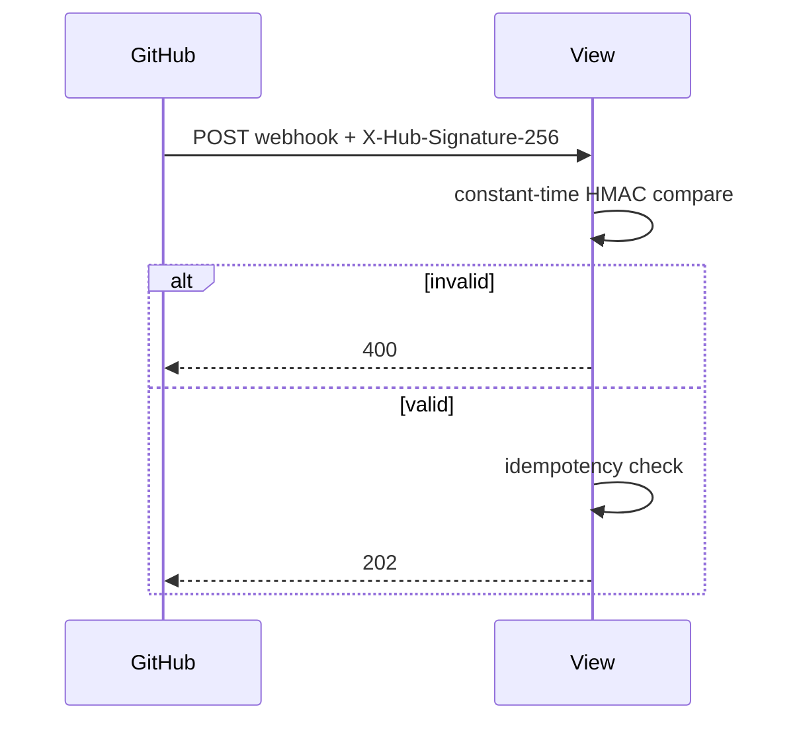

# API — Sentinel Review: API Reference

| Field | Value |
|---|---|
| Version | v0.1 |
| Last Updated | 2026-08-06 |
| Owner | Backend Engineer |
| Status | In Review |

---

> OpenAPI schema at `/api/schema/`; Swagger UI at `/api/docs/`. All REST under `/api/v1/`.

## 1. Webhook

| Method | Path | Auth | Description |
|---|---|---|---|
| POST | `/webhooks/github/` | HMAC-SHA256 | GitHub webhook receiver |

- Returns `202` when accepted, `400` on bad signature, `200` on idempotent dedup.
- Rate-limited (DRF throttles).

## 2. REST API (representative)

| Method | Path | Auth | Description |
|---|---|---|---|
| GET | `/api/v1/installations/` | Yes | List installations (paginated, searchable) |
| GET | `/api/v1/repos/` | Yes | List repos (`?search=`) |
| PATCH | `/api/v1/repos/{id}/config/` | Yes | Update repo config |
| GET | `/api/v1/pull-requests/` | Yes | List PRs (`?repo_id=`) |
| GET | `/api/v1/reviews/` | Yes | List reviews (`?pull_request_id=`, `?status=`) |
| GET | `/api/v1/comments/` | Yes | List comments (`?review_id=`, `?category=`, `?severity=`) |
| POST | `/api/v1/feedback/` | IsAuthenticated | Submit manual feedback |
| GET | `/api/v1/stats/` | Yes | Usefulness rate & metrics (`?repo=`) |

## 3. Operational

| Method | Path | Purpose |
|---|---|---|
| GET | `/health/` | Liveness |
| GET | `/health/ready/` | Readiness (DB + Redis) |
| GET | `/metrics` | Prometheus (if enabled) |
| GET | `/api/schema/` | OpenAPI JSON |
| GET | `/api/docs/` | Swagger UI |

## 4. Error Codes

| Code | Meaning | Retry? |
|---|---|---|
| 400 | Bad signature/request | No |
| 401 | Unauthenticated | Login |
| 403 | Forbidden | No |
| 404 | Not found | No |
| 429 | Rate limited | Yes (backoff) |

## 5. Auth Flow

## 6. Versioning Policy

- `/api/v1/` prefix; breaking changes → `/api/v2/`.

## 7. Related Documents

| Document | Relationship |
|---|---|
| [TechSpec.md](TechSpec.md) | API layer |
| [Schema.md](Schema.md) | Tables |
| [SecurityAndCompliance.md](SecurityAndCompliance.md) | HMAC + throttles |
| [AppFlow.md](AppFlow.md) | Flows |
| [PRD.md](PRD.md) | Requirements |
| [Design.md](Design.md) | Rendering |
| [ImplementationPlan.md](ImplementationPlan.md) | Tasks |
| [Tracker.md](Tracker.md) | Status |
| [Rules.md](Rules.md) | Standards |
| [Testing.md](Testing.md) | Contract tests |
| [Deployment.md](Deployment.md) | Deploy |
| [Glossary.md](Glossary.md) | Vocabulary |
| [RiskRegister.md](RiskRegister.md) | Risks |
