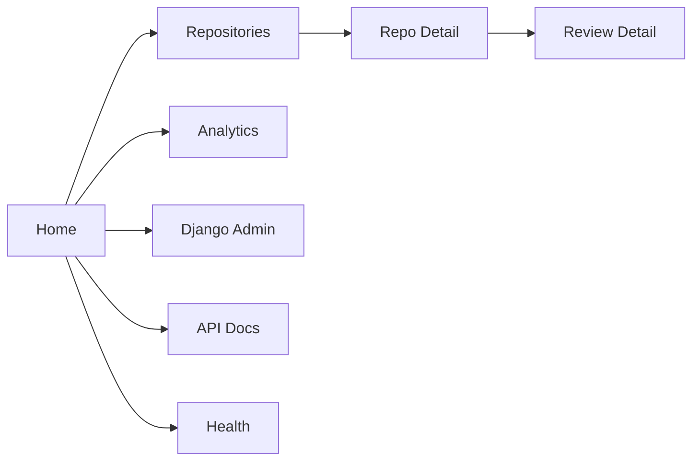
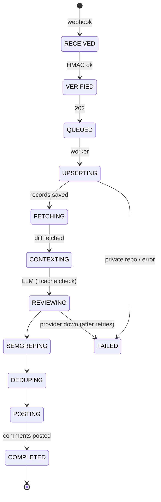
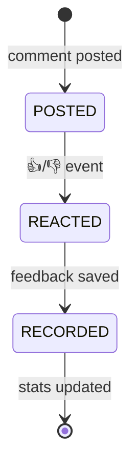

# AppFlow — Sentinel Review: Application Flow

| Field | Value |
|---|---|
| Version | v0.1 |
| Last Updated | 2026-08-06 |
| Owner | PM / QA |
| Status | In Review |

---

## 1. Screen Inventory

| SCR-### | Screen | Purpose | Entry | Exit | Auth |
|---|---|---|---|---|---|
| SCR-001 | Home | KPI cards, recent reviews, 7-day trend | `/` | all | Yes |
| SCR-002 | Repositories | Searchable list (HTMX) | `/repos/` | detail | Yes |
| SCR-003 | Repo Detail | Config panel + review history | `/repos/{id}/` | — | Yes |
| SCR-004 | Review Detail | Comments + 👍/👎 counts | `/reviews/{id}/` | — | Yes |
| SCR-005 | Analytics | Usefulness, volume, trends | `/stats/` | — | Yes |
| SCR-006 | Django Admin | Admin CRUD | `/admin/` | — | Staff |
| SCR-007 | API Docs | Swagger UI | `/api/docs/` | — | — |
| SCR-008 | Health | `/health/` + `/health/ready/` | ops | — | — |

## 2. Navigation Map

## 3. Detailed Flow per Journey

### Review lifecycle

### Feedback loop

## 4. Empty / Loading / Error States

| Screen | Empty | Loading | Error |
|---|---|---|---|
| Home | "No reviews yet" | skeleton | API error |
| Repos | "No repos" | HTMX indicator | — |
| Review Detail | "No comments" | — | 404 |
| Analytics | "No data" | chart load | — |

## 5. Edge Cases & Branching Logic

| IF condition | THEN route |
|---|---|
| HMAC invalid | 400, no enqueue |
| Same delivery_id | 200 idempotent skip |
| Private repo not opted in | Skip with log |
| LLM cache hit | Skip LLM call (<1ms) |
| Semgrep unavailable | Non-fatal skip |
| Malformed LLM JSON | Corrective retry once |
| Provider circuit OPEN | Cache/backoff, mark failed after retries |
| .sentinel-ignore match | Filtered out |

## 6. Notifications & Re-engagement

| Trigger | Channel | Destination |
|---|---|---|
| Review comments | GitHub inline | PR thread |
| Review failure | logs + Sentry | operators |
| Feedback | webhook → dashboard | stats |

## 7. Cross-Platform Deltas

- Server mode (webhook + dashboard) vs GHA mode (no server) — same pipeline core.

## 8. Related Documents

| Document | Relationship |
|---|---|
| [PRD.md](PRD.md) | US-001…007 |
| [TechSpec.md](TechSpec.md) | Components |
| [Design.md](Design.md) | Screens |
| [Schema.md](Schema.md) | Entities |
| [ImplementationPlan.md](ImplementationPlan.md) | Tasks |
| [Tracker.md](Tracker.md) | Status |
| [Rules.md](Rules.md) | Standards |
| [API.md](API.md) | Endpoints |
| [SecurityAndCompliance.md](SecurityAndCompliance.md) | Security |
| [Testing.md](Testing.md) | Tests |
| [Deployment.md](Deployment.md) | Env |
| [Glossary.md](Glossary.md) | Vocabulary |
| [RiskRegister.md](RiskRegister.md) | Risks |
