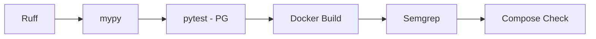

# Deployment — Sentinel Review: Environments, CI/CD, Rollback

| Field | Value |
|---|---|
| Version | v0.1 |
| Last Updated | 2026-08-06 |
| Owner | DevOps Engineer |
| Status | In Review |

---

## 1. Service Topology

| Service | Base | Purpose | Port |
|---|---|---|---|
| web | Django + gunicorn | HTTP (webhook, API, dashboard, health, metrics) | 8000 |
| worker | Celery | Reviews + feedback | — |
| redis | redis:7-alpine | Broker + backend + LLM cache | 6379 |
| db | postgres:16-alpine | Primary DB | 5432 |
| flower | mher/flower:2.0 | Celery monitoring (basic-auth) | 5555 |

## 2. CI/CD Pipeline (6 jobs)

## 3. Environment Promotion

| Step | From | To | Trigger |
|---|---|---|---|
| 1 | main | staging | CI green |
| 2 | staging | prod (Render/Fly) | manual |

Render Blueprint (`render.yaml`) + Fly (`fly.toml`) supported.

## 4. Rollback Procedure

1. Disable repo config flag (stop reviews instantly).
2. Revert image / `fly release`.
3. Verify no duplicate reviews (idempotency).

## 5. Feature Flags

- Per-repo config (feature flags via repo config panel).
- `METRICS_ENABLED`, `JSON_LOG`, `SENTRY_DSN`, `LLM_PROVIDER`.

## 6. On-Call / Runbook

- **Webhook failing:** check HMAC secret rotation + logs.
- **Queue growing:** add workers; check LLM/GitHub circuits.
- **No comments posting:** check GitHub token scopes/rate limits.
- **Flower:** basic-auth only.

## 7. Related Documents

| Document | Relationship |
|---|---|
| [TechSpec.md](TechSpec.md) | Environments |
| [SecurityAndCompliance.md](SecurityAndCompliance.md) | Secrets |
| [PRD.md](PRD.md) | Release criteria |
| [AppFlow.md](AppFlow.md) | Flows |
| [Schema.md](Schema.md) | Migrations |
| [Design.md](Design.md) | Design |
| [ImplementationPlan.md](ImplementationPlan.md) | Rollout |
| [Tracker.md](Tracker.md) | Status |
| [Rules.md](Rules.md) | Standards |
| [API.md](API.md) | Endpoints |
| [Testing.md](Testing.md) | CI gates |
| [Glossary.md](Glossary.md) | Vocabulary |
| [RiskRegister.md](RiskRegister.md) | Risks |
