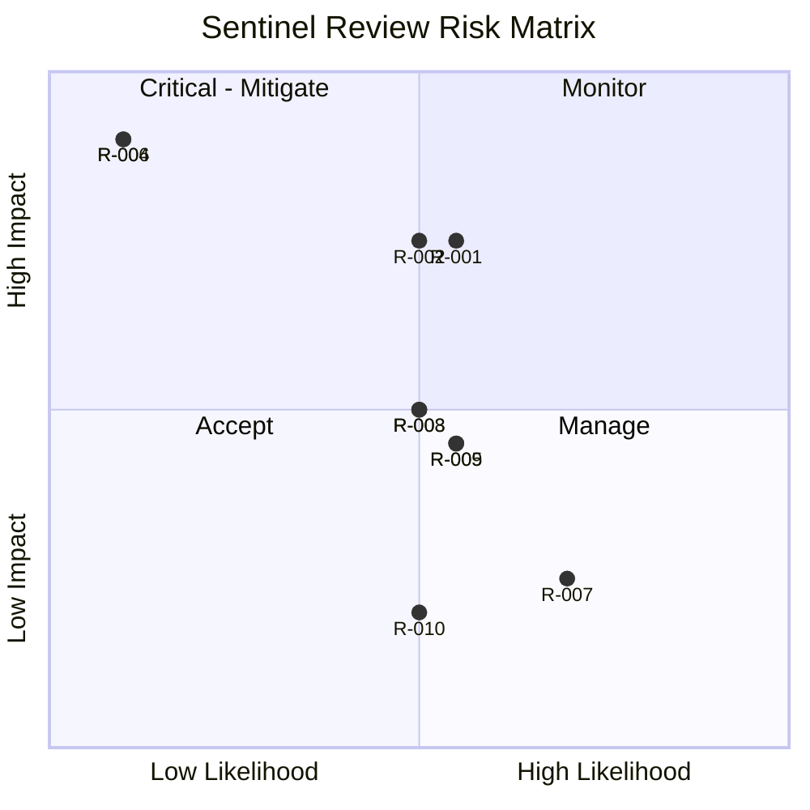

# RiskRegister — Sentinel Review: Known Risks

| Field | Value |
|---|---|
| Version | v0.1 |
| Last Updated | 2026-08-06 |
| Owner | PM / Eng Lead |
| Status | In Review |

---

| Risk | Likelihood | Impact | Score | Mitigation | Owner | Status |
|---|---|---|---|---|---|---|
| R-001 LLM noise/false positives | Medium | High | 6 | Severity honesty, dedupe, feedback loop | Eng | Mitigating |
| R-002 Provider outage | Medium | High | 6 | Circuit breakers + cache + retry | Eng | Mitigating |
| R-003 Malformed LLM output | Medium | Medium | 4 | Pydantic + corrective retry | Eng | Mitigating |
| R-004 Webhook forgery | Low | Critical | 8 | HMAC constant-time | Security | Mitigating |
| R-005 GitHub rate limits | Medium | Medium | 4 | Retry/backoff, token mgmt | DevOps | Open |
| R-006 Secret leakage in logs | Low | Critical | 8 | Log redaction + tests | Security | Mitigating |
| R-007 Local env missing deps | High | Low | 3 | Full requirements install | Eng | 🔴 Open (BLK-001) |
| R-008 WS/data scale (10K repos) | Medium | Medium | 4 | Pagination + indexes | Eng | Mitigating |
| R-009 LLM cost creep | Medium | Medium | 4 | LLM cache + rate limits | PM | Mitigating |
| R-010 Multi-language coverage | Medium | Low | 2 | Fixture roadmap | Eng | Open |

## Risk Matrix

## Related Documents

| Document | Relationship |
|---|---|
| [PRD.md](PRD.md) | Top-3 risks |
| [SecurityAndCompliance.md](SecurityAndCompliance.md) | R-004/006 |
| [TechSpec.md](TechSpec.md) | R-001/002/003 |
| [AppFlow.md](AppFlow.md) | Flows |
| [Design.md](Design.md) | Design |
| [Schema.md](Schema.md) | Data |
| [ImplementationPlan.md](ImplementationPlan.md) | Mitigations |
| [Tracker.md](Tracker.md) | BLK-001 |
| [Rules.md](Rules.md) | Standards |
| [API.md](API.md) | R-005 |
| [Testing.md](Testing.md) | Test coverage |
| [Deployment.md](Deployment.md) | Rollback |
| [Glossary.md](Glossary.md) | Vocabulary |
