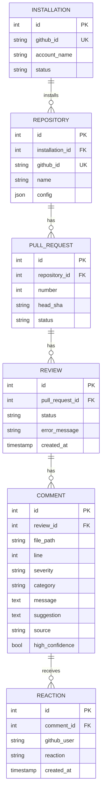

# Schema — Sentinel Review: Data Model

| Field | Value |
|---|---|
| Version | v0.1 |
| Last Updated | 2026-08-06 |
| Owner | Data Engineer |
| Status | In Review |

---

> 6 Django ORM models with composite indexes.

## 1. ER Diagram



## 2. Table/Collection Definitions

### TBL-comment
| Field | Type | Nullable | Default | Constraints | Description |
|---|---|---|---|---|---|
| id | int PK | No | auto | — | PK |
| review_id | int FK | No | — | → review | parent |
| file_path | string | No | — | — | file |
| line | int | Yes | — | ≥ 1 | line anchor |
| severity | enum | No | — | blocking/warning/nit | severity |
| category | enum | No | — | bug/style/security/suggestion | category |
| message | text | No | — | — | finding |
| suggestion | text | Yes | — | — | fix |
| source | enum | No | llm | llm/semgrep/llm+semgrep | origin |
| high_confidence | bool | No | false | — | dual-signal |

Composite index: (review_id, category).

### TBL-review
| Field | Type | Nullable | Default | Constraints | Description |
|---|---|---|---|---|---|
| id | int PK | No | auto | — | PK |
| pull_request_id | int FK | No | — | → pull_request | parent |
| status | enum | No | processing | processing/completed/failed | state |
| error_message | string | Yes | — | — | failure detail |
| created_at | timestamp | No | now() | — | when |

### TBL-reaction
| Field | Type | Nullable | Default | Constraints | Description |
|---|---|---|---|---|---|
| id | int PK | No | auto | — | PK |
| comment_id | int FK | No | — | → comment | parent |
| github_user | string | No | — | — | reactor |
| reaction | enum | No | — | thumbs_up/thumbs_down | vote |
| created_at | timestamp | No | now() | — | when |

Composite index: (comment_id, reaction).

## 3. Relationships & Foreign Keys

| Table A | Table B | On delete | Justification |
|---|---|---|---|
| review | pull_request | cascade | reviews follow PR |
| comment | review | cascade | comments follow review |
| reaction | comment | cascade | reactions follow comment |
| pull_request | repository | cascade | PRs follow repo |

## 4. Indexes

| Table | Index | Columns | Type | Reason |
|---|---|---|---|---|
| comment | idx_comment_review_cat | (review_id, category) | composite | filter by category |
| reaction | idx_reaction_comment | (comment_id, reaction) | composite | usefulness stats |
| review | idx_review_status | (status) | btree | status queries |
| pull_request | idx_pr_repo | (repository_id) | btree | repo history |

## 5. Enums / Constants

| Enum | Allowed values |
|---|---|
| severity | blocking, warning, nit |
| category | bug, style, security, suggestion |
| review.status | processing, completed, failed |
| reaction | thumbs_up, thumbs_down |
| source | llm, semgrep, llm+semgrep |
| throttles | 100/hr anon, 1000/hr auth |

## 6. Data Lifecycle

- Reviews/comments retained for metrics (no purge in v1).
- Idempotency dedup via delivery_id (Redis + in-memory).

## 7. Migrations Strategy

- Tool: Django migrations (consolidated to single 0001_initial).
- Rollback: `python manage.py migrate <previous>`.

## 8. Sample Records

```json
{
  "comment": {
    "review_id": 5, "file_path": "app/load.py", "line": 42,
    "severity": "blocking", "category": "security",
    "message": "pickle.load() on untrusted input",
    "source": "llm+semgrep", "high_confidence": true
  }
}
```

## 9. Data Validation Rules

| Field | DB constraint | App layer |
|---|---|---|
| severity/category | enum | Pydantic schemas |
| line | ≥ 1 | Pydantic |
| message | non-empty | Pydantic |

## 10. Sensitive Data Map

| Field | Sensitivity | Encrypted at rest? | Masked in logs? |
|---|---|---|---|
| github tokens | credential | env/secrets | never logged |
| repo config | internal | — | — |
| comment content | code-derived | — | log redaction of secrets |
| feedback | none | — | — |

## 11. Related Documents

| Document | Relationship |
|---|---|
| [API.md](API.md) | Endpoints touching tables |
| [TechSpec.md](TechSpec.md) | Models layer |
| [PRD.md](PRD.md) | Requirements |
| [AppFlow.md](AppFlow.md) | Flows |
| [Design.md](Design.md) | Display data |
| [ImplementationPlan.md](ImplementationPlan.md) | Tasks |
| [Tracker.md](Tracker.md) | Status |
| [Rules.md](Rules.md) | Standards |
| [SecurityAndCompliance.md](SecurityAndCompliance.md) | Sensitive map |
| [Testing.md](Testing.md) | Data tests |
| [Deployment.md](Deployment.md) | Migrations |
| [Glossary.md](Glossary.md) | Vocabulary |
| [RiskRegister.md](RiskRegister.md) | Risks |
