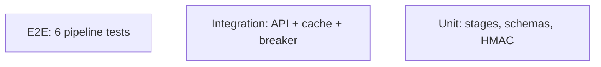

# Testing — Sentinel Review: Test Strategy

| Field | Value |
|---|---|
| Version | v0.1 |
| Last Updated | 2026-08-06 |
| Owner | QA Engineer |
| Status | In Review |

---

## 1. Test Pyramid

## 2. Strategy

| Layer | Tool | Scope |
|---|---|---|
| Unit | pytest | 22 files: HMAC, schemas, cache, breaker, ignore rules, logging |
| Integration | pytest-django | API, models, feedback |
| E2E | pytest (test_e2e.py) | Full webhook→comments pipeline |
| Mocking | respx | GitHub/LLM boundaries mocked |

Current: **352 tests, 91% coverage** (mypy strict).

> Note: local collection fails without Django installed (BLK-001) — install requirements in backend venv.

## 3. Critical Test Cases

| ID | Feature | Case | Expected |
|---|---|---|---|
| TC-001 | HMAC | Valid + tampered signatures | accept / 400 |
| TC-002 | Schemas | Malformed LLM JSON | Corrective retry once |
| TC-003 | Cache | Diff hash hit | Skip LLM call |
| TC-004 | Breaker | Provider down | OPEN → fallback |
| TC-005 | Ignore | .sentinel-ignore globs | Filtered |
| TC-006 | E2E | Webhook → inline comments | Review posted |
| TC-007 | Feedback | 👍/👎 recorded | Stats updated |
| TC-008 | Health | /health/ + /health/ready/ | Correct status |
| TC-009 | Metrics | /metrics exposed | Latency/error/queue |
| TC-010 | Self-review | pickle.load planted | blocking/security, high confidence |

## 4. Test Data Strategy

- Fixture repos with planted vulns; mocked HTTP/LLM at boundaries.
- Eval set builder (`scripts/build_eval_set.py`).

## 5. CI Gates (6 jobs)

- Ruff lint → mypy → pytest (PostgreSQL) → Docker build → Semgrep → compose check.

## 6. Related Documents

| Document | Relationship |
|---|---|
| [Rules.md](Rules.md) | Coverage requirements |
| [PRD.md](PRD.md) | Release criteria |
| [TechSpec.md](TechSpec.md) | Components |
| [AppFlow.md](AppFlow.md) | Flow tests |
| [Schema.md](Schema.md) | Data tests |
| [API.md](API.md) | Contract tests |
| [Design.md](Design.md) | UI tests |
| [ImplementationPlan.md](ImplementationPlan.md) | Test tasks |
| [Tracker.md](Tracker.md) | BLK-001 |
| [SecurityAndCompliance.md](SecurityAndCompliance.md) | Security tests |
| [Deployment.md](Deployment.md) | CI gates |
| [Glossary.md](Glossary.md) | Vocabulary |
| [RiskRegister.md](RiskRegister.md) | Risks |
