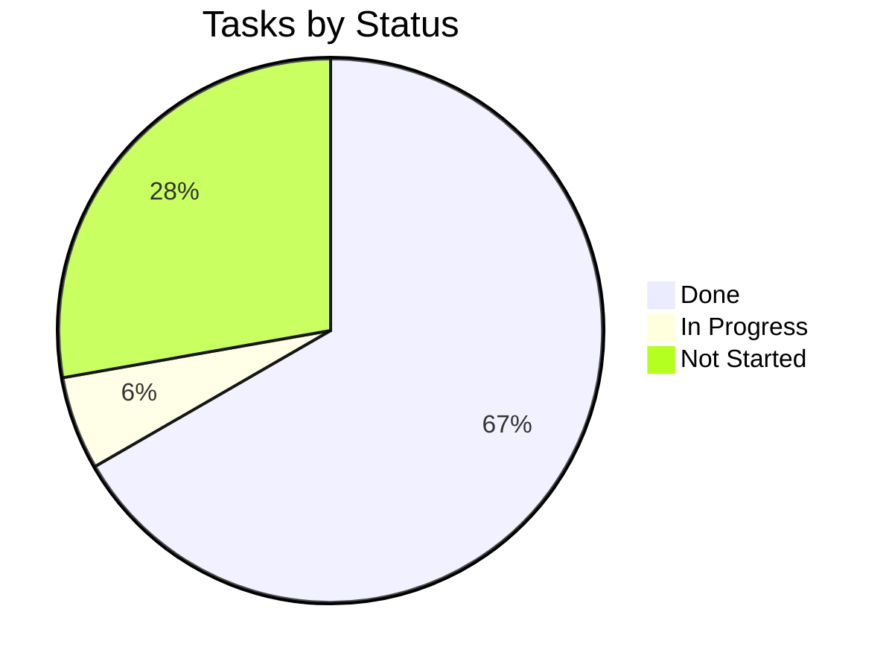

# Tracker — Sentinel Review: Living Status Tracker

| Field | Value |
|---|---|
| Version | v0.1 |
| Last Updated | 2026-08-06 |
| Owner | Engineering Lead |
| Status | In Review |

---

## 1. Snapshot Dashboard

| Metric | Value |
|---|---|
| Overall % Complete | 70% |
| Current Phase | Phase 3 |
| Tasks Done / Total | 13 / 17 |
| Blockers (open) | 1 |
| Days to Target Launch | 25 |

## 2. Status Legend

🟢 Done | 🟡 In Progress | 🔴 Blocked | ⚪ Not Started | 🔵 In Review

## 3. Phase Progress Bars

| Phase | Progress |
|---|---|
| Phase 0: Skeleton | `[████████░░] 100%` |
| Phase 1: Staged | `[████████░░] 100%` |
| Phase 2: Resilience | `[████████░░] 100%` |
| Phase 3: Feedback/Dash | `[█████░░░░░] 50%` |
| Phase 4: Modes/Deploy | `[░░░░░░░░░░] 0%` |

## 4. Full Task Table

| TASK | Description | Status | Assignee | Start | Target | Actual | Notes |
|---|---|---|---|---|---|---|---|
| TASK-0.1 | Django scaffold | 🟢 | Eng | 2026-06-01 | 2026-06-05 | — | |
| TASK-0.2 | Webhook + HMAC | 🟢 | Eng | 2026-06-05 | 2026-06-09 | — | |
| TASK-0.3 | Celery + models | 🟢 | Eng | 2026-06-09 | 2026-06-15 | — | |
| TASK-1.1 | ReviewContext + stages | 🟢 | Eng | 2026-06-16 | 2026-06-22 | — | |
| TASK-1.2 | LLM + Pydantic | 🟢 | Eng | 2026-06-22 | 2026-06-26 | — | |
| TASK-1.3 | Semgrep + dedupe + post | 🟢 | Eng | 2026-06-26 | 2026-07-02 | — | |
| TASK-2.1 | LLM cache | 🟢 | Eng | 2026-07-03 | 2026-07-07 | — | |
| TASK-2.2 | Circuit breakers | 🟢 | Eng | 2026-07-07 | 2026-07-11 | — | |
| TASK-2.3 | Logs + metrics + Sentry | 🟢 | Eng | 2026-07-11 | 2026-07-15 | — | |
| TASK-2.4 | Rate limits + auth | 🟢 | Security | 2026-07-15 | 2026-07-18 | — | |
| TASK-3.1 | Feedback webhook | 🟡 | Eng | 2026-07-19 | — | — | in progress |
| TASK-3.2 | Dashboard pages | ⚪ | FE | — | — | — | |
| TASK-4.1 | GHA action | ⚪ | Eng | — | — | — | |
| TASK-4.2 | .sentinel-ignore | ⚪ | Eng | — | — | — | |
| TASK-4.3 | Render/Fly + Docker | ⚪ | DevOps | — | — | — | |
| TASK-4.4 | Evaluation + demo | ⚪ | Eng | — | — | — | |

## 5. Blockers Log

| ID | Description | Raised | Owner | Impact | Status |
|---|---|---|---|---|---|
| BLK-001 | Local env missing django module → test collection fails | 2026-08-01 | Eng | Local pytest cannot run | 🔴 Open — `pip install -r requirements*.txt` in backend venv |

## 6. Changelog

| Date | What shipped |
|---|---|
| 2026-08-06 | Docs suite v0.1 |
| 2026-07-18 | Resilience phase complete |

## 7. Burndown Summary

## 8. Next 3 Priorities

1. Finish TASK-3.1 — Feedback webhook.
2. TASK-3.2 — Dashboard pages (HTMX + Chart.js).
3. TASK-4.1 — GHA composite action.

## 9. Related Documents

| Document | Relationship |
|---|---|
| [ImplementationPlan.md](ImplementationPlan.md) | Tasks |
| [PRD.md](PRD.md) | Features |
| [TechSpec.md](TechSpec.md) | Components |
| [AppFlow.md](AppFlow.md) | Flows |
| [Design.md](Design.md) | Design |
| [Schema.md](Schema.md) | Data |
| [Rules.md](Rules.md) | Standards |
| [API.md](API.md) | Contract |
| [SecurityAndCompliance.md](SecurityAndCompliance.md) | Security |
| [Testing.md](Testing.md) | Tests |
| [Deployment.md](Deployment.md) | Deploy |
| [Glossary.md](Glossary.md) | Vocabulary |
| [RiskRegister.md](RiskRegister.md) | Risks |
