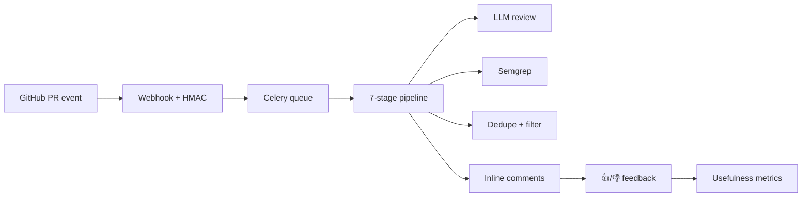

# PRD — Sentinel Review: Autonomous GitHub PR-Review Agent

|Field|Value|
|---|---|
|Version|v0.1|
|Last Updated|2026-08-06|
|Owner|Product Manager|
|Status|In Review|

---

## 1. Executive Summary

Sentinel Review is an autonomous GitHub PR-review agent that reads diffs in full repo context, produces severity-ranked (blocking/warning/nit), category-labeled (bug/style/security/suggestion), line-anchored review comments, and proves its own usefulness with a feedback loop (👍/👎 on every comment). It combines LLM reasoning (Claude/GPT-4o) with deterministic static analysis (Semgrep), validates output with Pydantic, processes asynchronously via Celery + Redis (returns 202 in <10s), and runs either as a self-hosted Django service (webhook mode) or as a zero-infrastructure GitHub Action.

## 2. Problem Statement

- **User pain:** Code review is the highest-leverage quality practice and the hardest to scale. Linters miss semantic bugs; LLM reviewers produce noisy summaries; humans are expensive and slow.
- **Evidence/context:** Post-audit score 9.0/10 (from 5.7), 352 tests, 91% coverage, staged 7-module pipeline, circuit breakers, LLM cache, webhook idempotency, feedback loop.
- **Cost of not solving it:** Bugs and security issues merge silently; review is a delivery bottleneck.

## 3. Goals & Non-Goals

|Goal|Metric|Target|
|---|---|---|
|Line-anchored comments|Comments on diff lines|100%|
|Usefulness (feedback loop)|👍 rate|≥ 70% (target)|
|Low-noise|Clean PRs get zero comments|verified|
|Webhook latency|202 returned|< 10s|
|Coverage|Test coverage|91%|

### Non-Goals (v1)
- Non-GitHub platforms (GitLab/Bitbucket).
- Automated code fixes/merging.
- Training/fine-tuning custom models.
- Multi-region deployment.

## 4. Target Users & Personas

|Persona|Role|Goals|Frustrations|Quote|Tech Comfort|
|---|---|---|---|---|---|
|Dev — Software Engineer|Ships PRs|Fast, relevant feedback|Noisy bots|"Tell me what's wrong, on the line."|High|
|Priya — Tech Lead|Reviews PRs|Less manual review|Time sink|"Catch what I'd catch."|High|
|Omar — DevSecOps|Security gates|Deterministic + LLM signals|False positives|"Show me high-confidence findings."|High|

## 5. User Stories

|ID|As a...|I want...|So that...|Priority|Acceptance Criteria|
|---|---|---|---|---|---|
|US-001|Developer|inline comments on my diff|I fix in context|P0|Line-anchored comments posted|
|US-002|Developer|severity + category labels|I prioritize|P0|blocking/warning/nit + category|
|US-003|Developer|clean PRs stay clean|bot isn't noise|P0|No comments on clean PRs|
|US-004|Lead|feedback metrics|I trust the bot|P1|👍/👎 + usefulness dashboard|
|US-005|DevSecOps|Semgrep + LLM agreement|high confidence|P1|`high_confidence` flag|
|US-006|Developer|.sentinel-ignore|skip vendored files|P1|Glob patterns honored|
|US-007|Operator|run without server|zero infra|P1|GHA composite action|

## 6. Feature List

|ID|Epic|Feature|Description|Priority|Status|
|---|---|---|---|---|---|
|REQ-001|Pipeline|Webhook receiver + HMAC|Signature-verified ingestion|P0|Done|
|REQ-002|Pipeline|Celery async processing|202 in <10s|P0|Done|
|REQ-003|Pipeline|7-stage staged pipeline|Upsert→Fetch→Context→LLM→Semgrep→Dedupe→Post|P0|Done|
|REQ-004|LLM|Pydantic-validated output|Corrective retry on malformed JSON|P0|Done|
|REQ-005|LLM|Response cache|SHA256 diff-hash → Redis|P1|Done|
|REQ-006|Static|Semgrep integration|Merged with LLM findings|P1|Done|
|REQ-007|Delivery|Line-anchored comments|GitHub Create Review API|P0|Done|
|REQ-008|Feedback|👍/👎 loop|Usefulness metrics|P1|Done|
|REQ-009|Resilience|Circuit breakers|GitHub + LLM providers|P1|Done|
|REQ-010|Ops|Health/ready + metrics|`/health/`, `/health/ready/`, `/metrics`|P1|Done|
|REQ-011|Config|.sentinel-ignore|Glob exclusions|P1|Done|
|REQ-012|Modes|GHA execution mode|Zero-infra reviews|P1|Done|
|REQ-013|Ops|Auth + rate limiting|DRF throttles, IsAuthenticated|P1|Done|

## 7. User Journeys (high level)

## 8. Success Metrics / KPIs

|Metric|Target|Measurement|
|---|---|---|
|North Star: usefulness rate|≥ 70% 👍|dashboard|
|Review latency (async)|202 < 10s|webhook logs|
|Test health|352 passing, 91%|CI|
|Audit score|9.0/10|evaluation|
|False positives|0 on self-review demo|demo|

## 9. Assumptions & Dependencies

- GitHub App (least-privilege: contents read, PRs read/write, metadata read).
- Anthropic or OpenAI key; WEBHOOK_SECRET + DJANGO_SECRET_KEY required (fail-fast).
- Redis + PostgreSQL (Docker compose or hosted).
- Semgrep available (or skipped non-fatally).

## 10. Risks

Top 3 (full list in ../project/RiskRegister.md):
1. **LLM noise/false positives** — mitigated by severity honesty, dedupe, feedback loop.
2. **Provider outages** — mitigated by circuit breakers + retry + cache.
3. **Malformed LLM output** — mitigated by Pydantic validation + corrective retry.

## 11. Release Criteria

- [ ] 352 tests pass; coverage 91%.
- [ ] End-to-end: webhook → 7-stage → inline comments.
- [ ] Self-review demo: pickle.load CWE-502 caught with high confidence.
- [ ] Feedback loop + stats dashboard live.
- [ ] Docker compose (5 services) boots healthy.
- [ ] GHA mode works without server.

## 12. Open Questions

|Question|Owner|Resolve by|
|---|---|---|
|Slack/email notification hooks?|PM|Release 1.1|
|Multi-language fixture set (TS/Go/Ruby)?|Eng Lead|Release 1.1|
|Kubernetes/Helm chart?|DevOps|Release 2.0|

## 13. Related Documents

|Document|Relationship|
|---|---|
|[TechSpec.md](../technical/TechSpec.md)|Architecture, pipeline|
|[AppFlow.md](../design/AppFlow.md)|Dashboard + flows|
|[Design.md](../design/Design.md)|Dashboard design|
|[Schema.md](../technical/Schema.md)|6 ORM models|
|[ImplementationPlan.md](../project/ImplementationPlan.md)|Build plan|
|[Tracker.md](../project/Tracker.md)|Task status|
|[Rules.md](../project/Rules.md)|Standards|
|[API.md](../technical/API.md)|REST + webhook contracts|
|[SecurityAndCompliance.md](../technical/SecurityAndCompliance.md)|HMAC, auth|
|[Testing.md](../technical/Testing.md)|352 tests|
|[Deployment.md](../technical/Deployment.md)|Render/Fly/GHA|
|[Glossary.md](../reference/Glossary.md)|Vocabulary|
|[RiskRegister.md](../project/RiskRegister.md)|Risks|
