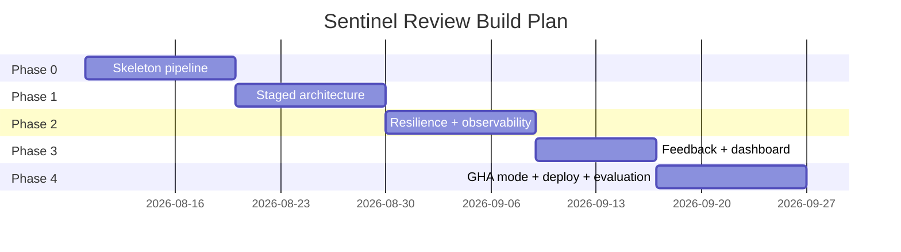
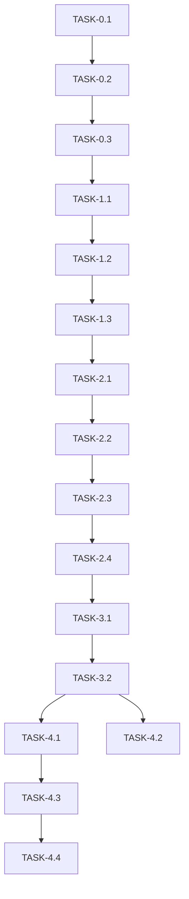

# ImplementationPlan — Sentinel Review: Phased Build Plan

|Field|Value|
|---|---|
|Version|v0.1|
|Last Updated|2026-08-06|
|Owner|Engineering Lead|
|Status|In Review|

---

## 1. Build Philosophy

Walking skeleton: webhook → queue → worker → one LLM call → inline comment. Then harden into 7 staged modules with typed ReviewContext, add Semgrep, cache, circuit breakers, feedback loop, and finally the dashboard + GHA mode. The audit (5.7 → 9.0) drove P0 remediation first.

## 2. Phase Overview

## 3. Phase Breakdown

### Phase 0: Skeleton
- Goal: end-to-end review loop.
- Exit: webhook → inline comment on fixture repo.

|TASK-#|Description|Depends on|Owner|Est.|Maps to|
|---|---|---|---|---|---|
|TASK-0.1|Django + DRF scaffold + startup validation|—|Eng|3d|REQ-013|
|TASK-0.2|Webhook + HMAC + idempotency|TASK-0.1|Eng|3d|REQ-001|
|TASK-0.3|Celery + models + single review function|TASK-0.2|Eng|4d|REQ-002, TBL-*|

### Phase 1: Staged Architecture
- Goal: 7 named stages.
- Exit: each stage unit-testable.

|TASK-#|Description|Depends on|Owner|Est.|Maps to|
|---|---|---|---|---|---|
|TASK-1.1|ReviewContext + Upsert/Fetch stages|TASK-0.3|Eng|4d|REQ-003|
|TASK-1.2|LLM stage + Pydantic validation|TASK-1.1|Eng|3d|REQ-004|
|TASK-1.3|Semgrep + Dedupe + Post stages|TASK-1.2|Eng|4d|REQ-003, REQ-006, REQ-007|

### Phase 2: Resilience
- Goal: cache, breakers, observability.
- Exit: outage simulations pass.

|TASK-#|Description|Depends on|Owner|Est.|Maps to|
|---|---|---|---|---|---|
|TASK-2.1|LLM cache (SHA256)|TASK-1.3|Eng|3d|REQ-005|
|TASK-2.2|Circuit breakers (GitHub + LLM)|TASK-2.1|Eng|3d|REQ-009|
|TASK-2.3|JSON logs + Prometheus + Sentry|TASK-2.2|Eng|3d|REQ-010|
|TASK-2.4|Rate limits + auth controls|TASK-2.3|Security|2d|REQ-013|

### Phase 3: Feedback + Dashboard
- Goal: 👍/👎 + stats.
- Exit: usefulness metrics live.

|TASK-#|Description|Depends on|Owner|Est.|Maps to|
|---|---|---|---|---|---|
|TASK-3.1|Feedback webhook + reactions|TASK-2.4|Eng|3d|REQ-008|
|TASK-3.2|Dashboard pages (HTMX + Chart.js)|TASK-3.1|FE|5d|SCR-001..005|

### Phase 4: Modes & Deploy
- Goal: GHA mode, deployment configs, evaluation.
- Exit: self-review demo passes.

|TASK-#|Description|Depends on|Owner|Est.|Maps to|
|---|---|---|---|---|---|
|TASK-4.1|GHA composite action + runner|TASK-3.2|Eng|4d|REQ-012|
|TASK-4.2|.sentinel-ignore|TASK-3.2|Eng|2d|REQ-011|
|TASK-4.3|Render/Fly configs + Docker|TASK-4.1|DevOps|3d|[Deployment.md](../technical/Deployment.md)|
|TASK-4.4|Evaluation + comparison + self-review demo|TASK-4.3|Eng|3d|US-005|

## 4. Dependency Graph

## 5. Environment & Tooling Setup Checklist

- [ ] Docker Compose (web, worker, redis, db, flower)
- [ ] `.env` with DJANGO_SECRET_KEY, WEBHOOK_SECRET, GITHUB_APP_ID, GITHUB_APP_PRIVATE_KEY_B64, LLM key
- [ ] GitHub App created (least-privilege)
- [ ] ngrok for local webhook
- [ ] `pytest` (352) green; `ruff check .`; `mypy sentinel_review/`

## 6. Rollout Strategy

- Feature flags via repo config (per-repo enablement).
- Canary: enable on low-traffic repos.
- GHA mode as zero-infra fallback.
- Rollback: disable repo flag; revert image.

## 7. Definition of Done (global)

- [ ] Tests pass (352, 91% coverage)
- [ ] Docs updated (this suite + ADR if decision)
- [ ] Reviewed + CODEOWNERS
- [ ] Gitleaks/Semgrep clean
- [ ] E2E verified

## 8. Related Documents

|Document|Relationship|
|---|---|
|[PRD.md](../product/PRD.md)|REQ mapping|
|[TechSpec.md](../technical/TechSpec.md)|Components|
|[AppFlow.md](../design/AppFlow.md)|Flows|
|[Schema.md](../technical/Schema.md)|Data|
|[Design.md](../design/Design.md)|UI tasks|
|[Tracker.md](Tracker.md)|Status|
|[Rules.md](Rules.md)|Standards|
|[API.md](../technical/API.md)|Contract|
|[SecurityAndCompliance.md](../technical/SecurityAndCompliance.md)|Security|
|[Testing.md](../technical/Testing.md)|Tests|
|[Deployment.md](../technical/Deployment.md)|Rollout|
|[Glossary.md](../reference/Glossary.md)|Vocabulary|
|[RiskRegister.md](RiskRegister.md)|Risks|
