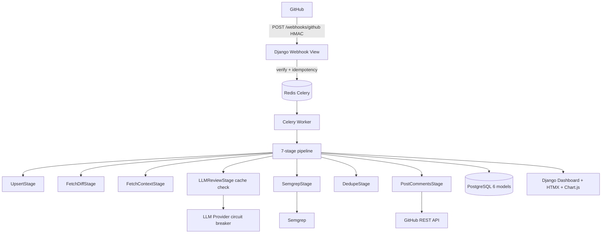
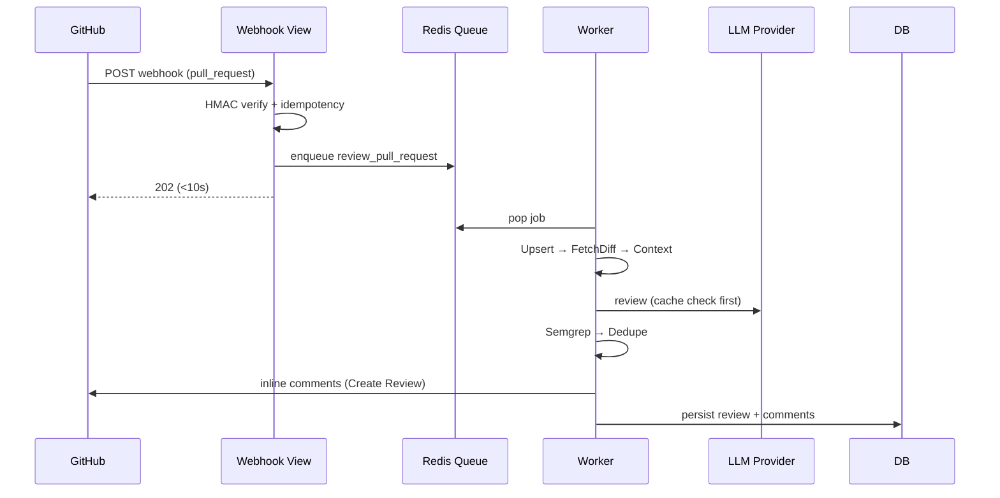
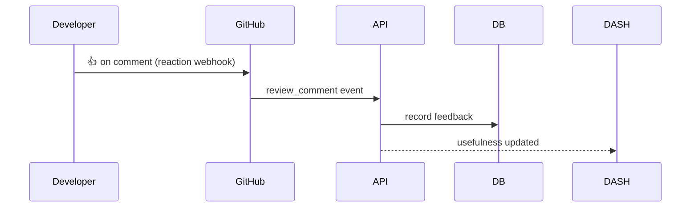

# TechSpec — Sentinel Review: Technical Specification

| Field | Value |
| --- | --- |
| Version | v0.1 |
| Last Updated | 2026-08-06 |
| Owner | Engineering Lead |
| Status | In Review |

---

## 1. Architecture Overview

## 2. Tech Stack Table

| Layer | Technology | Version | Justification |
| --- | --- | --- | --- |
| Backend | Django + DRF | 5.x | Batteries-included |
| Async | Celery + Redis | 5.x/7 | Durable queue |
| DB | PostgreSQL | 16 | JSONField config |
| Frontend | Templates + HTMX + Alpine.js | — | Zero Node runtime |
| Charts | Chart.js | 4.x | Server-rendered data |
| LLM | Claude Sonnet / GPT-4o | — | Tool-use structured output |
| Validation | Pydantic v2 | — | Strict schemas |
| Static analysis | Semgrep | — | Deterministic signal |
| GitHub API | PyJWT + httpx | — | App auth → inline comments |
| Testing | pytest + pytest-django + respx + mypy | — | 352 tests, 91% |
| CI/CD | GitHub Actions | — | 6-job pipeline |
| Infra | Docker + compose | — | 5 services |

## 3. System Components

| Component | Responsibility | Inputs → Outputs | Scaling | Failure Modes |
| --- | --- | --- | --- | --- |
| Django webhook view | HMAC verify + idempotency + enqueue | webhook → 202 | horizontal | bad signature → reject |
| Celery worker | Run 7-stage pipeline | job → review | add workers | stage fail → review FAILED |
| LLM provider | Review diff | context → findings | quota | circuit breaker |
| Semgrep stage | Static scan | diff → findings | in-process | non-fatal skip |
| Cache | LLM responses + dedup | hash → result | Redis | in-memory fallback |
| Circuit breaker | GitHub/LLM health | call → open/closed | per-provider | protects thundering herd |
| Django dashboard | Stats UI | API → HTMX | — | — |
| GHA runner | Zero-infra mode | PR → comments | per-job | — |

## 4. Data Flow Diagrams

## 5. Third-Party Integrations

| Service | Purpose | Failure Fallback | Cost Model | Rate Limits |
| --- | --- | --- | --- | --- |
| GitHub API | Read diff, post comments | Circuit breaker + retry | Free quota | ~5000/hr |
| GitHub webhooks | Events + reactions | idempotent dedup | Free | event-driven |
| Anthropic/OpenAI | LLM review | cache hit / retry | token | quota |
| Semgrep | Static analysis | skip (non-fatal) | free tier | local |
| Sentry | Error tracking | no-op | free tier | — |

## 6. Non-Functional Requirements

| Category | Requirement | Target | How Verified |
| --- | --- | --- | --- |
| Latency | Webhook 202 | < 10s | logs |
| Throughput | Async reviews | 100s/day per worker | load |
| Availability | Provider outages | circuit breaker + cache | tests |
| Security | HMAC + auth + throttles | enforced | tests |
| Observability | JSON logs + metrics + Sentry | all stages | Grafana |
| Testability | Staged pipeline | each stage unit-testable | tests |

## 7. Environments

| Env | URL | Data | Deploy |
| --- | --- | --- | --- |
| dev | localhost:8000 | SQLite/Redis local | docker compose |
| staging | staging | sample repos | CI |
| prod | Render/Fly | real | blueprint/manual |

## 8. Error Handling Strategy

- HMAC failure → 400 (constant-time compare).
- Stage failure → review marked FAILED with specific error; remaining stages skipped.
- LLM malformed JSON → corrective retry (once) with validation error shown.
- Provider outage → circuit breaker OPEN; cached reviews served.
- Idempotency: same delivery_id → 200 skip.

## 9. Observability

- JSON structured logs (task_id, module, latency).
- Prometheus `/metrics`: latency, error rate, queue depth, cache hit rate.
- Sentry (conditional via SENTRY_DSN).
- Flower (Celery monitoring, basic-auth).

## 10. Technical Risks & Mitigations

| Risk | Mitigation |
| --- | --- |
| LLM noise | Severity honesty, dedupe, feedback loop |
| Provider outage | Circuit breakers + cache + retry |
| Malformed output | Pydantic + corrective retry |
| GitHub rate limits | Retry/backoff + token management |

## 11. Related Documents

| Document | Relationship |
| --- | --- |
| [PRD.md](../product/PRD.md) | Requirements |
| [Schema.md](Schema.md) | 6 models |
| [API.md](API.md) | Webhook + REST |
| [AppFlow.md](../design/AppFlow.md) | Flows |
| [Design.md](../design/Design.md) | Dashboard |
| [ImplementationPlan.md](../project/ImplementationPlan.md) | Phases |
| [Tracker.md](../project/Tracker.md) | Status |
| [Rules.md](../project/Rules.md) | Standards |
| [SecurityAndCompliance.md](SecurityAndCompliance.md) | HMAC + auth |
| [Testing.md](Testing.md) | Tests |
| [Deployment.md](Deployment.md) | Deploy |
| [Glossary.md](../reference/Glossary.md) | Vocabulary |
| [RiskRegister.md](../project/RiskRegister.md) | Risks |
